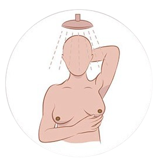
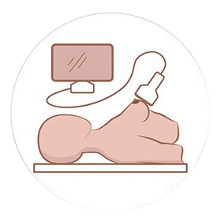
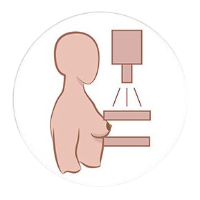
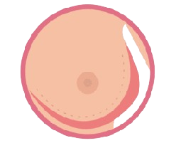
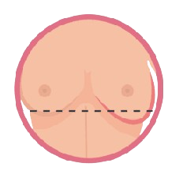
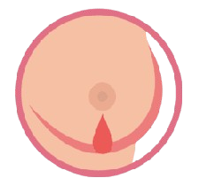

# WORKSHOP - WEB DEVELOPMENT

# Initialization

This HTML code defines the structure of our webpage. The code includes essential **metadata**, **styles**, **fonts**, and **scripts** to enhance the appearance and functionality of the webpage.

```html
<!DOCTYPE html>
<html lang="en">

<head>
  <meta charset="UTF-8">
  <meta http-equiv="X-UA-Compatible" content="IE=edge">
  <meta name="viewport" content="width=device-width, initial-scale=1.0">

  <title>Breast Cancer Awareness</title>
  <meta name="title" content="Breast Cancer Awareness">
  <meta name="description" content="This is a breast cancer awareness website">

  <link rel="shortcut icon" href="assets/images/fav.png" type="image/png">

  <link rel="stylesheet" href="assets/css/style.css">

  <link rel="preconnect" href="https://fonts.googleapis.com">
  <link rel="preconnect" href="https://fonts.gstatic.com" crossorigin>
  <link href="https://fonts.googleapis.com/css2?family=Roboto:wght@400;500;700&display=swap" rel="stylesheet">

</head>

<body>

  <script src="assets/js/script.js" defer></script>

  <script type="module" src="https://unpkg.com/ionicons@5.5.2/dist/ionicons/ionicons.esm.js"></script>
  <script nomodule src="https://unpkg.com/ionicons@5.5.2/dist/ionicons/ionicons.js"></script>

</body>

</html>

```

## 1. Document Type Declaration

`<!DOCTYPE html>`

Declares that this is an HTML5 document.

---

## 2. HTML Element

`<html lang="en">`

- The root element of the document.
- `lang="en"` specifies the language as English.

---

## 3. Head Section

The `<head>` section contains metadata, styles, fonts, and scripts.

### 3.1 Character Encoding

`<meta charset="UTF-8">`

- Sets the character encoding to UTF-8, supporting a wide range of characters.

### 3.2 Compatibility

`<meta http-equiv="X-UA-Compatible" content="IE=edge">`

- Ensures compatibility with the latest version of Internet Explorer.

### 3.3 Viewport Settings

`<meta name="viewport" content="width=device-width, initial-scale=1.0">`

- Configures the viewport for responsive design, ensuring the page scales correctly on various devices.

### 3.4 Page Title

`<title>Breast Cancer Awareness</title>`

- Sets the title displayed on the browser tab.

### 3.5 Metadata

- **Title**: `<meta name="title" content="Breast Cancer Awareness">`    (Describes the webpage title).
- **Description**: `<meta name="description" content="This is a breast cancer awareness website">` (Provides a brief description for search engines (SEO)).

### 3.6 Favicon

`<link rel="shortcut icon" href="assets/images/fav.png" type="image/png">`

- Sets the favicon for the webpage, located in `assets/images` as `fav.png`.

### 3.7 Stylesheet

`<link rel="stylesheet" href="assets/css/style.css">`

- Links to the external CSS file (`style.css`) in `assets/css` for styling the webpage.

### 3.8 Google Fonts

```html
<link rel="preconnect" href="[https://fonts.googleapis.com](https://fonts.googleapis.com/)">
<link rel="preconnect" href="[https://fonts.gstatic.com](https://fonts.gstatic.com/)" crossorigin>
<link href="[https://fonts.googleapis.com/css2?family=Roboto:wght@400;500;700&display=swap](https://fonts.googleapis.com/css2?family=Roboto:wght@400;500;700&display=swap)" rel="stylesheet">
```

- **Preconnects** to Google Fonts and imports the **Roboto** font with weights of 400, 500, and 700.

## 4. Body Section

The `<body>` contains the main content of the webpage. Currently, it includes only scripts.

### 4.1 JavaScript File

`<script src="assets/js/script.js" defer></script>`

- Loads the external JavaScript file (`script.js`) located in `assets/js`.
- The `defer` attribute ensures that the script runs after the HTML is parsed.

### 4.2 Ionicons (Icon Library)

```html
<script type="module" src="[https://unpkg.com/ionicons@5.5.2/dist/ionicons/ionicons.esm.js](https://unpkg.com/ionicons@5.5.2/dist/ionicons/ionicons.esm.js)"></script>
<script nomodule src="[https://unpkg.com/ionicons@5.5.2/dist/ionicons/ionicons.js](https://unpkg.com/ionicons@5.5.2/dist/ionicons/ionicons.js)"></script>
```

- Loads **Ionicons** for icon usage:
    - The **module** version is for modern browsers.
    - The **nomodule** version supports older browsers.

```css
:root {

  --medium-spring-green: hsl(0, 0%, 100%);
  --red-orange-creyola: hsl(0, 100%, 68%);
  --caribbean-green: hsl(160, 98%, 39%);
  --blush-pink_50: hsla(213, 86%, 16%, 0.5);
  --blush-pink_70: hsla(213, 86%, 16%, 0.7);
  --prussian-blue: hsl(210, 100%, 20%);
  --blush-pink: hsl(312, 46%, 17%);
  --orange-peel: hsl(37, 100%, 50%);
  --cultured_20: hsla(206, 23%, 94%, 0.2);
  --winter-sky: hsl(341, 100%, 60%);
  --light-gray: hsl(0, 0%, 80%);
  --malachite: hsl(120, 70%, 59%);
  --indigo-dye: hsl(213, 85%, 3%);
  --dim-gray: hsl(0, 0%, 41%);
  --black_20: hsla(0, 0%, 0%, 0.2);
  --silver: hsl(0, 0%, 76%);
  --black: hsl(0, 0%, 0%);
  --white: hsl(0, 0%, 100%);

  --ff-roboto: "Roboto", sans-serif;

  --fs-1: 3rem;
  --fs-2: 2.4rem;
  --fs-3: 2rem;
  --fs-4: 1.8rem;
  --fs-5: 1.5rem;
  --fs-6: 1.4rem;

  --fw-500: 500;
  --fw-700: 700;

  --section-padding: 100px;

  --shadow-1: 0 0 10px hsla(0, 0%, 0%, 0.1);
  --shadow-2: 0 5px 10px hsla(0, 0%, 100%, 0.2);
  --shadow-3: 0 0 24px hsla(341, 100%, 60%, 0.3);

  --radius-circle: 50%;
  --radius-pill: 200px;
  --radius-6: 6px;

  --transition-1: 0.25s ease;
  --transition-2: 0.5s ease;
  --cubic-out: cubic-bezier(0.33, 0.85, 0.4, 0.96);

}

*, *::before, *::after {
  margin: 0;
  padding: 0;
  box-sizing: border-box;
}

li{ 
  list-style: none; 
}

a, img, span, button, ion-icon{ 
  display: block; 
}

a{
  color: inherit;
  text-decoration: none;
}

img { 
  height: auto;
}

button {
  background: none;
  border: none;
  font: inherit;
  cursor: pointer;
}

ion-icon{
  pointer-events: none; 
}

address{ 
  font-style: normal; 
}
```

## 1. Root Variables

The `:root` selector defines custom CSS variables for global use throughout the stylesheet. These variables help maintain a consistent design.

### 1.1 Colors

- `-medium-spring-green: hsl(0, 0%, 100%)`
- `-red-orange-creyola: hsl(0, 100%, 68%)`
- `-caribbean-green: hsl(160, 98%, 39%)`
- `-blush-pink_50: hsla(213, 86%, 16%, 0.5)`
- `-blush-pink_70: hsla(213, 86%, 16%, 0.7)`
- `-prussian-blue: hsl(210, 100%, 20%)`
- `-blush-pink: hsl(312, 46%, 17%)`
- `-orange-peel: hsl(37, 100%, 50%)`
- `-cultured_20: hsla(206, 23%, 94%, 0.2)`
- `-winter-sky: hsl(341, 100%, 60%)`
- `-light-gray: hsl(0, 0%, 80%)`
- `-malachite: hsl(120, 70%, 59%)`
- `-indigo-dye: hsl(213, 85%, 3%)`
- `-dim-gray: hsl(0, 0%, 41%)`
- `-black_20: hsla(0, 0%, 0%, 0.2)`
- `-silver: hsl(0, 0%, 76%)`
- `-black: hsl(0, 0%, 0%)`
- `-white: hsl(0, 0%, 100%)`

These color variables use HSL/HSLA values for consistency and flexibility, allowing for easy adjustments and transparency settings.

### 1.2 Font Family

- `-ff-roboto: "Roboto", sans-serif`Defines the Roboto font as the main font for the website.

### 1.3 Font Sizes

- `-fs-1: 3rem`
- `-fs-2: 2.4rem`
- `-fs-3: 2rem`
- `-fs-4: 1.8rem`
- `-fs-5: 1.5rem`
- `-fs-6: 1.4rem`

These variables set different font sizes, making it easy to apply consistent typography.

### 1.4 Font Weights

- `-fw-500: 500`
- `-fw-700: 700`

Defines font weights for normal and bold text.

### 1.5 Spacing

- `-section-padding: 100px`Sets a standard padding value for sections.

### 1.6 Shadows

- `-shadow-1: 0 0 10px hsla(0, 0%, 0%, 0.1)`
- `-shadow-2: 0 5px 10px hsla(0, 0%, 100%, 0.2)`
- `-shadow-3: 0 0 24px hsla(341, 100%, 60%, 0.3)`

Defines shadow effects used for elements like cards, buttons, or modals.

### 1.7 Border Radius

- `-radius-circle: 50%`
- `-radius-pill: 200px`
- `-radius-6: 6px`

These variables set border radii for circular and rounded elements.

### 1.8 Transitions and Animations

- `-transition-1: 0.25s ease`
- `-transition-2: 0.5s ease`
- `-cubic-out: cubic-bezier(0.33, 0.85, 0.4, 0.96)`

These values define transition speeds and timing functions for smooth animations.

---

## 2. Global Resets and Basic Styling

### 2.1 Universal Reset

```css
*, *::before, *::after {
  margin: 0;
  padding: 0;
  box-sizing: border-box;
}
```

- Resets margin and padding for all elements and pseudo-elements.
- Sets `box-sizing` to `border-box` to include padding and border in the element’s width and height, ensuring consistent layout behavior.

### 2.2 List Items

```css
li {
  list-style: none;
}
```

- Removes default bullet points from list items.

### 2.3 Block Elements

```css
a, img, span, button, ion-icon {
  display: block;
}
```

- Forces these elements to behave as block elements, making them take the full width of their parent container.

### 2.4 Links

```css
a {
  color: inherit;
  text-decoration: none;
}
```

- Ensures links inherit the text color and removes the default underline.

### 2.5 Images

```css
img {
  height: auto;
}
```

- Sets images to scale proportionally while maintaining their aspect ratio.

### 2.6 Buttons

```css
button {
  background: none;
  border: none;
  font: inherit;
  cursor: pointer;
}
```

- Removes default button styles and sets them to inherit the font styles. Also, it sets the cursor to a pointer when hovering over buttons.

### 2.7 Ionicons

```css
ion-icon {
  pointer-events: none;
}
```

- Disables pointer events for ionicons, preventing them from interfering with mouse interactions.

### 2.8 Address

```css
address {
  font-style: normal;
}
```

- Sets the address element to have normal font style, overriding the browser’s default italic styling.

# General Styling

```css
html{
  font-family: var(--ff-roboto);
  font-size: 10px;
  scroll-behavior: smooth;
}

body{
  background-color: var(--blush-pink);
  color: var(--white);
  font-size: 1.6rem;
  line-height: 1.5;
  overflow-x: hidden;
}

body.active{ 
  overflow-y: hidden; 
}

:focus-visible{ 
  outline-offset: 4px; 
}

::-webkit-scrollbar{ 
  width: 10px; 
}

::-webkit-scrollbar-track{ 
  background-color: hsl(0, 0%, 98%); 
}

::-webkit-scrollbar-thumb{ 
  background-color: hsl(0, 0%, 80%); 
}

::-webkit-scrollbar-thumb:hover{ 
  background-color: hsl(0, 0%, 70%); 
}

.container { 
  padding-inline: 15px; 
}

.section { 
  padding-block: var(--section-padding); 
}

.has-bg-image {
  background-repeat: no-repeat;
  background-position: center;
  background-size: cover;
  height: 100vh;
}

.h1, .h2, .h3, .h4{ 
  line-height: 1.4; 
}

.h1{ 
  font-size: var(--fs-2); 
}

.h4{ 
  font-size: var(--fs-4); 
}
```

## 1. HTML and Body Styling

### 1.1 HTML Element

```css
html {
  font-family: var(--ff-roboto);
  font-size: 10px;
  scroll-behavior: smooth;
}
```

- **Font Family**: Sets the Roboto font (`var(--ff-roboto)`) as the base font for the entire document.
- **Font Size**: Sets the root font size to `10px`, making it easy to calculate rem units (e.g., `1.6rem` equals `16px`).
- **Scroll Behavior**: `scroll-behavior: smooth;` enables smooth scrolling when navigating through anchor links.

### 1.2 Body Element

```css
body {
  background-color: var(--blush-pink);
  color: var(--white);
  font-size: 1.6rem;
  line-height: 1.5;
  overflow-x: hidden;
}
```

- **Background Color**: Applies the `-blush-pink` color as the background.
- **Text Color**: Sets the text color to `-white` for high contrast.
- **Font Size**: Sets the default body text size to `1.6rem` (equivalent to `16px`).
- **Line Height**: Sets line spacing to `1.5` for improved readability.
- **Overflow**: Hides horizontal overflow (`overflow-x: hidden`) to prevent unwanted scrolling.

### 1.3 Body Active State

```css
body.active {
  overflow-y: hidden;
}
```

- Disables vertical scrolling when the body has the `active` class, useful for modals or mobile menus.

### 1.4 Focus Outline

```css
:focus-visible {
  outline-offset: 4px;
}
```

- Ensures that focusable elements (e.g., links, buttons) have an outline offset of `4px`, improving visibility for keyboard navigation.

---

## 2. Scrollbar Customization

### 2.1 Webkit Scrollbar Styles

```css
::-webkit-scrollbar {
  width: 10px;
}
```

- Sets the scrollbar width to `10px` for a consistent look.

### 2.2 Scrollbar Track

```css
::-webkit-scrollbar-track {
  background-color: hsl(0, 0%, 98%);
}
```

- Sets the background color of the scrollbar track to a light gray (`hsl(0, 0%, 98%)`).

### 2.3 Scrollbar Thumb

```css
::-webkit-scrollbar-thumb {
  background-color: hsl(0, 0%, 80%);
}
```

- Styles the scrollbar thumb with a slightly darker shade of gray (`hsl(0, 0%, 80%)`).

### 2.4 Scrollbar Thumb Hover

```css
::-webkit-scrollbar-thumb:hover {
  background-color: hsl(0, 0%, 70%);
}
```

- Changes the scrollbar thumb to a darker shade when hovered for a visual cue.

---

## 3. Layout and Containers

### 3.1 Container

```css
.container {
  padding-inline: 15px;
}
```

- Adds `15px` of padding to the left and right of the container for consistent spacing.

### 3.2 Section

```css
.section {
  padding-block: var(--section-padding);
}
```

- Applies vertical padding (`-section-padding`) to sections for consistent spacing between them.

### 3.3 Background Image Styling

```css
.has-bg-image {
  background-repeat: no-repeat;
  background-position: center;
  background-size: cover;
  height: 100vh;
}
```

- **No Repeat**: Ensures the background image does not repeat.
- **Center Position**: Centers the image within the element.
- **Cover Size**: Scales the image to cover the entire area of the element.
- **Height**: Sets the height to `100vh` (100% of the viewport height) for full-screen sections.

---

## 4. Typography

### 4.1 Heading Line Height

```css
.h1, .h2, .h3, .h4 {
  line-height: 1.4;
}
```

- Applies consistent line height (`1.4`) to all heading elements for uniform vertical spacing.

### 4.2 Heading Sizes

```css
.h1 {
  font-size: var(--fs-2);
}
.h4 {
  font-size: var(--fs-4);
}
```

- Sets specific font sizes for headings using the defined font size variables:
    - `.h1` uses `var(--fs-2)` (larger font size).
    - `.h4` uses `var(--fs-4)` (smaller font size).

# Header

```html
  <header class="header" data-header>
    <div class="container">

      <a href="#" class="logo">
        
      </a>

      <nav class="navbar" data-navbar>
        <ul class="navbar-list">

          <li class="navbar-item">
            <a href="#home" class="navbar-link" data-nav-link>Home</a>
          </li>

          <li class="navbar-item">
            <a href="#about" class="navbar-link" data-nav-link>About</a>
          </li>

          <li class="navbar-item">
            <a href="#symptoms" class="navbar-link" data-nav-link>Symptoms</a>
          </li>

        </ul>
      </nav>

      <button class="nav-toggle-btn" aria-label="toggle menu" data-nav-toggler>
        <ion-icon name="menu-outline" aria-hidden="true" class="menu"></ion-icon>
        <ion-icon name="close-outline" aria-hidden="true" class="close"></ion-icon>
      </button>

      <a href="#" class="btn btn-primary">Are You Sick</a>

    </div>
  </header>
```

## 1. Header Structure

### 1.1 Header Element

```html
<header class="header" data-header>
  <div class="container">
    <!-- Content Here -->
  </div>
</header>
```

- **Class**: The `header` class is used for styling and layout purposes.
- **Data Attribute**: `data-header` could be used for JavaScript interactions or styling hooks.
- **Container**: The header's content is wrapped in a `div` with the `container` class, ensuring consistent padding and alignment.

---

## 2. Logo Section

### 2.1 Logo Link

```html
<a href="#" class="logo">
  
</a>
```

- **Anchor Tag**: Wraps the logo image in a link (`<a>`) that redirects to the homepage or top of the site (`href="#"`).
- **Class**: The `logo` class is used for styling purposes.
- **Image**: An image element with a source (`src="assets/images/logo.png"`), a set width (`100`), and height (`30`). The `alt` attribute provides alternative text for accessibility.

---

## 3. Navigation Menu

### 3.1 Navbar Element

```html
<nav class="navbar" data-navbar>
  <ul class="navbar-list">
    <!-- Navbar Items Here -->
  </ul>
</nav>
```

- **Class**: The `navbar` class styles the navigation section.
- **Data Attribute**: `data-navbar` could be used for controlling the state of the navbar via JavaScript.
- **List Container**: The unordered list (`<ul>`) with the class `navbar-list` contains individual navigation items.

### 3.2 Navigation Items

```html
<li class="navbar-item">
  <a href="#home" class="navbar-link" data-nav-link>Home</a>
</li>

<li class="navbar-item">
  <a href="#about" class="navbar-link" data-nav-link>About</a>
</li>

<li class="navbar-item">
  <a href="#symptoms" class="navbar-link" data-nav-link>Symptoms</a>
</li>
```

- **List Items**: Each `<li>` element represents a navigation item with the class `navbar-item`.
- **Links**:
    - Each item contains an anchor tag (`<a>`) linking to a section on the page (e.g., `#home`, `#about`, `#symptoms`).
    - The `navbar-link` class styles the link, and the `data-nav-link` attribute might be used for JavaScript interactions (e.g., highlighting active links).

---

## 4. Navigation Toggle Button

### 4.1 Toggle Button

```html
<button class="nav-toggle-btn" aria-label="toggle menu" data-nav-toggler>
  <ion-icon name="menu-outline" aria-hidden="true" class="menu"></ion-icon>
  <ion-icon name="close-outline" aria-hidden="true" class="close"></ion-icon>
</button>
```

- **Class**: `nav-toggle-btn` styles the button, making it visible and interactive.
- **ARIA Label**: `aria-label="toggle menu"` provides an accessible label for screen readers, indicating the button's function.
- **Data Attribute**: `data-nav-toggler` is likely used for toggling the menu state via JavaScript (e.g., opening/closing the menu).
- **Icons**:
    - The button includes two icons (`<ion-icon>`):
        - **Menu Icon** (`name="menu-outline"`): Shown when the menu is closed.
        - **Close Icon** (`name="close-outline"`): Shown when the menu is open.
    - Both icons have `aria-hidden="true"` to hide them from screen readers.

---

## 5. Primary Button

### 5.1 Call-to-Action Button

```html
<a href="#" class="btn btn-primary">Are You Sick</a>
```

- **Anchor Tag**: Functions as a button, linking to a specific section or page.
- **Classes**:
    - `btn` is the general button styling class.
    - `btn-primary` is likely used to style the button with primary color and emphasis.
- **Text**: Displays the message "Are You Sick" as a call-to-action, encouraging user interaction.

# Header Styling

```css
.logo{
  z-index: 100;
}

.btn{
  font-size: var(--fs-6);
  font-weight: var(--fw-700);
  text-transform: uppercase;
  max-width: max-content;
  border: 2px solid var(--white);
  padding: 18px 25px;
  border-radius: var(--radius-pill);
  transition: var(--transition-1);
}

.btn-primary:is(:hover, :focus){ 
    box-shadow: var(--shadow-2); 
    background-color: rgba(255, 255, 255, 0.716);
    transition: linear 0.5s;
}

.w-100 { 
  width: 100%; 
}

.text { 
  font-size: var(--fs-5); 
}

.img-holder {
  aspect-ratio: var(--width) / var(--height);
  background-color: transparent;
  overflow: hidden;
}

.section-text { 
  margin-block: 15px 35px; 
}

.grid-list {
  display: grid;
  gap: 30px;
}

.img-cover {
  width: 100%;
  height: 100%;
  object-fit: cover;
  transition: var(--transition-2);
}

.header .btn { 
  display: none; 
}

.header {
  background-color: var(--blush-pink);
  position: absolute;
  top: 0;
  left: 0;
  width: 100%;
  padding-block: 12px;
  box-shadow: var(--shadow-1);
  z-index: 4;
}

.header.active {
  position: fixed;
  opacity: .9;
  animation: slideInTop 0.5s ease forwards;
}

@keyframes slideInTop {
  0% { transform: translateY(-100%); }
  100% { transform: translateY(0); }
}

.header .container {
  display: flex;
  justify-content: space-between;
  align-items: center;
}

.nav-toggle-btn {
  color: var(--white);
  font-size: 35px;
}

.nav-toggle-btn.active .menu, .nav-toggle-btn .close { 
  display: none; 
}

.nav-toggle-btn .menu, .nav-toggle-btn.active .close { 
  display: block; 
}

.navbar {
  position: absolute;
  top: 74px;
  left: -350px;
  width: 100%;
  max-width: 350px;
  height: 100vh;
  background-color: var(--blush-pink);
  padding: 20px;
  transition: 0.25s var(--cubic-out);
  visibility: hidden;
}

.navbar.active {
  visibility: visible;
  transform: translateX(350px);
  transition-duration: 0.5s;
}

.navbar-item:not(:last-child) { 
  border-block-end: 1px solid var(--black_20); 
}

.navbar-link {
  padding-block: 10px;
  transition: var(--transition-1);
}

.navbar-link:is(:hover, :focus) { 
  color: var(--winter-sky); 
}
```

## 1. Button Styling

### 1.1 Logo (`.logo`)

```css
.logo {
  z-index: 100;
}
```

- The `.logo` class applies styles to an element that represents a logo, typically an image or an anchor element containing an image.
- **`z-index: 100`**:
    - The `z-index` property specifies the stack order of an element, determining its position along the z-axis (front-to-back) relative to other overlapping elements.
    - A higher `z-index` value (like `100`) brings the logo element to the front, ensuring it appears above other elements with lower `z-index` values.
    - This is particularly useful when dealing with layered elements, such as a sticky navbar or other content that might overlap with the logo.

### Practical Use:

- Setting a high `z-index` for the logo ensures it remains visible and on top of other elements, regardless of layout changes or scrolling behavior.

### 1.2 General Button (`.btn`)

```css
.btn {
  font-size: var(--fs-6);
  font-weight: var(--fw-700);
  text-transform: uppercase;
  max-width: max-content;
  border: 2px solid var(--white);
  padding: 18px 25px;
  border-radius: var(--radius-pill);
  transition: var(--transition-1);
}
```

- **Font Size**: Uses `var(--fs-6)` for consistency.
- **Font Weight**: Set to bold (`var(--fw-700)`).
- **Text Transformation**: Uppercase for a bold appearance.
- **Max Width**: Ensures the button only takes up as much space as its content.
- **Border**: A solid white border with a width of `2px`.
- **Padding**: Provides space inside the button for visual clarity.
- **Border Radius**: Creates a rounded, pill-like appearance (`var(--radius-pill)`).
- **Transition**: Applies a smooth transition (`var(--transition-1)`) for hover effects.

### 1.3 Primary Button Hover/Focus (`.btn-primary`)

```css
.btn-primary:is(:hover, :focus) {
  box-shadow: var(--shadow-2);
  background-color: rgba(255, 255, 255, 0.716);
  transition: linear 0.5s;
}
```

- **Hover/Focus States**: Applies shadow (`var(--shadow-2)`) and a semi-transparent background color when the button is hovered over or focused.
- **Transition**: Linear transition effect over `0.5s` for smooth visual change.

---

## 2. Width and Text Styles

### 2.1 Full Width (`.w-100`)

```css
.w-100 {
  width: 100%;
}
```

- Sets the element's width to `100%`, making it fill the container.

### 2.2 Text Size (`.text`)

```css
.text {
  font-size: var(--fs-5);
}
```

- Uses a font size defined as `var(--fs-5)` for consistent typography.

---

## 3. Image and Grid Styling

### 3.1 Image Holder (`.img-holder`)

```css
.img-holder {
  aspect-ratio: var(--width) / var(--height);
  background-color: transparent;
  overflow: hidden;
}
```

- **Aspect Ratio**: Maintains the aspect ratio based on custom properties.
- **Overflow**: Ensures any overflowing content is hidden, useful for image cropping.

### 3.2 Grid List (`.grid-list`)

```css
.grid-list {
  display: grid;
  gap: 30px;
}
```

- **Grid Display**: Uses CSS Grid for layout with a gap of `30px` between items.

### 3.3 Image Cover (`.img-cover`)

```css
.img-cover {
  width: 100%;
  height: 100%;
  object-fit: cover;
  transition: var(--transition-2);
}
```

- **Object Fit**: Ensures the image covers the container without distortion.
- **Transition**: Applies a smooth transition (`var(--transition-2)`).

---

## 4. Header Styling

### 4.1 General Header (`.header`)

```css
.header {
  background-color: var(--blush-pink);
  position: absolute;
  top: 0;
  left: 0;
  width: 100%;
  padding-block: 12px;
  box-shadow: var(--shadow-1);
  z-index: 4;
}
```

- **Background**: Sets the background color using `var(--blush-pink)`.
- **Position**: Positioned at the top left (`absolute`) with a width of `100%`.
- **Padding**: Adds `12px` of padding vertically.
- **Box Shadow**: Applies a subtle shadow (`var(--shadow-1)`).
- **Z-Index**: Keeps the header on top of other elements (`z-index: 4`).

### 4.2 Active State (`.header.active`)

```css
.header.active {
  position: fixed;
  opacity: .9;
  animation: slideInTop 0.5s ease forwards;
}
```

- **Fixed Position**: Stays in a fixed location when active.
- **Opacity**: Reduces opacity to `0.9` for a semi-transparent effect.
- **Animation**: The `slideInTop` animation moves the header down smoothly.

### 4.3 Animation Keyframes (`@keyframes slideInTop`)

```css
@keyframes slideInTop {
  0% { transform: translateY(-100%); }
  100% { transform: translateY(0); }
}
```

- Defines an animation that slides the header in from the top.

---

## 5. Navigation and Toggle Button

### 5.1 Toggle Button (`.nav-toggle-btn`)

```css
.nav-toggle-btn {
  color: var(--white);
  font-size: 35px;
}
```

- **Color**: Sets the icon color to white.
- **Font Size**: Sets the icon size to `35px`.

### 5.2 Toggle Button States

```css
.nav-toggle-btn.active .menu, .nav-toggle-btn .close {
  display: none;
}

.nav-toggle-btn .menu, .nav-toggle-btn.active .close {
  display: block;
}
```

- **Active States**: Controls visibility of icons when toggling the navigation menu.

### 5.3 Navbar Styles (`.navbar`)

```css
.navbar {
  position: absolute;
  top: 74px;
  left: -350px;
  width: 100%;
  max-width: 350px;
  height: 100vh;
  background-color: var(--blush-pink);
  padding: 20px;
  transition: 0.25s var(--cubic-out);
  visibility: hidden;
}
```

- **Position**: Positioned off-screen initially (`left: -350px`).
- **Background and Padding**: Styled with padding and a pink background.
- **Transition**: Applies a cubic-bezier transition for smooth opening/closing effects.
- **Visibility**: Hidden initially, revealed when active.

### 5.4 Navbar Active State (`.navbar.active`)

```css
.navbar.active {
  visibility: visible;
  transform: translateX(350px);
  transition-duration: 0.5s;
}
```

- Moves the navbar into view (`translateX(350px)`) when activated, with a `0.5s` transition.

---

## 6. Navbar Items and Links

### 6.1 Navbar Items (`.navbar-item`)

```css
.navbar-item:not(:last-child) {
  border-block-end: 1px solid var(--black_20);
}
```

- Adds a border at the bottom of each item except the last one.

### 6.2 Navbar Links (`.navbar-link`)

```css
.navbar-link {
  padding-block: 10px;
  transition: var(--transition-1);
}

.navbar-link:is(:hover, :focus) {
  color: var(--winter-sky);
}
```

- Adds padding and a smooth transition for hover and focus states, changing the link color to `var(--winter-sky)` when interacted with.

# Header JavaScript

```jsx
const addEventOnElem = function (elem, type, callback) {
    if (elem.length > 1) {
        for (let i = 0; i < elem.length; i++) {
            elem[i].addEventListener(type, callback);
        }
    } else {
        elem.addEventListener(type, callback);
    }
}

const navbar = document.querySelector("[data-navbar]");
const navToggler = document.querySelector("[data-nav-toggler]");
const navbarLinks = document.querySelectorAll("[data-nav-link]");

const toggleNavbar = function () {
    navbar.classList.toggle("active");
    navToggler.classList.toggle("active");
    document.body.classList.toggle("active");
}

addEventOnElem(navToggler, "click", toggleNavbar);

const closeNavbar = function () {
    navbar.classList.remove("active");
    navToggler.classList.remove("active");
    document.body.classList.remove("active");
}

addEventOnElem(navbarLinks, "click", closeNavbar);

const header = document.querySelector("[data-header]");
const backTopBtn = document.querySelector("[data-back-top-btn]");

const activeElemOnScroll = function () {
    if (window.scrollY > 100) {
        header.classList.add("active");
        backTopBtn.classList.add("active");
    } else {
        header.classList.remove("active");
        backTopBtn.classList.remove("active");
    }
}

addEventOnElem(window, "scroll", activeElemOnScroll);
```

## 1. Utility Function: `addEventOnElem`

```jsx
const addEventOnElem = function (elem, type, callback) {
    if (elem.length > 1) {
        for (let i = 0; i < elem.length; i++) {
            elem[i].addEventListener(type, callback);
        }
    } else {
        elem.addEventListener(type, callback);
    }
}
```

### Explanation:

- This function is a utility to add event listeners to one or multiple elements.
- **Parameters**:
    - `elem`: The element(s) to which the event listener is attached. It could be a single element or a list of elements (like a `NodeList`).
    - `type`: The type of event (e.g., `"click"` or `"scroll"`).
    - `callback`: The function to be executed when the event occurs.
- **Logic**:
    - If `elem` contains multiple elements (`elem.length > 1`), the function iterates through each element and adds the event listener.
    - If it’s a single element, the event listener is added directly.

---

## 2. Navbar Toggling

### 2.1 Variables Declaration

```jsx
const navbar = document.querySelector("[data-navbar]");
const navToggler = document.querySelector("[data-nav-toggler]");
const navbarLinks = document.querySelectorAll("[data-nav-link]");
```

- **`navbar`**: Selects the navbar element using the `[data-navbar]` attribute.
- **`navToggler`**: Selects the element (button) used to toggle the navbar (`[data-nav-toggler]`).
- **`navbarLinks`**: Selects all navbar link elements (`[data-nav-link]`) in the navbar.

### 2.2 Navbar Toggle Function

```jsx
const toggleNavbar = function () {
    navbar.classList.toggle("active");
    navToggler.classList.toggle("active");
    document.body.classList.toggle("active");
}
```

- **Purpose**: Toggles the visibility of the navbar.
- **Logic**:
    - Toggles the `"active"` class on the `navbar`, `navToggler`, and `document.body`.
    - This activates/deactivates certain CSS styles that show/hide the navbar and affect body overflow.

### 2.3 Adding the Toggle Event

```jsx
addEventOnElem(navToggler, "click", toggleNavbar);
```

- Adds a `"click"` event listener to the `navToggler` button, calling `toggleNavbar` when clicked.

---

## 3. Close Navbar on Link Click

### 3.1 Close Navbar Function

```jsx
const closeNavbar = function () {
    navbar.classList.remove("active");
    navToggler.classList.remove("active");
    document.body.classList.remove("active");
}
```

- **Purpose**: Closes the navbar when a link inside it is clicked.
- **Logic**:
    - Removes the `"active"` class from the `navbar`, `navToggler`, and `document.body` to revert any styles applied when the navbar is open.

### 3.2 Adding the Close Event

```jsx
addEventOnElem(navbarLinks, "click", closeNavbar);
```

- Adds a `"click"` event listener to each link in the navbar (`navbarLinks`). When any link is clicked, the navbar closes using the `closeNavbar` function.

---

## 4. Scroll Effects

### 4.1 Variables Declaration

```jsx
const header = document.querySelector("[data-header]");
const backTopBtn = document.querySelector("[data-back-top-btn]");
```

- **`header`**: Selects the header element using the `[data-header]` attribute.
- **`backTopBtn`**: Selects the "back to top" button (`[data-back-top-btn]`).

### 4.2 Scroll-Activated Function

```jsx
const activeElemOnScroll = function () {
    if (window.scrollY > 100) {
        header.classList.add("active");
        backTopBtn.classList.add("active");
    } else {
        header.classList.remove("active");
        backTopBtn.classList.remove("active");
    }
}
```

- **Purpose**: Activates certain elements when the user scrolls past a specific point.
- **Logic**:
    - If the scroll position (`window.scrollY`) is greater than `100px`:
        - The `"active"` class is added to the `header` and `backTopBtn` elements.
    - If not, the `"active"` class is removed.
    - This adds/removes styles like fixed positioning or visibility to enhance the user experience.

### 4.3 Adding the Scroll Event

```jsx
addEventOnElem(window, "scroll", activeElemOnScroll);
```

- Adds a `"scroll"` event listener to the `window` object, calling `activeElemOnScroll` whenever the user scrolls.

# Main

```html
  <main>
    <article>

      <section class="section hero has-bg-image" id="home" style="background-image: url('assets/images/hero-bg.png')"
        aria-label="home">
      </section>

      <section class="section about" id="about" aria-labelledby="about-label-1">
        <div class="container">
    
            <figure class="about-banner">
                
            </figure>
    
            <div class="about-content">
    
                <p class="about-subtitle" id="about-label-1">Understanding Breast Cancer</p>
    
                <h2 class="h2 section-title">What You Need to Know</h2>
    
                <p class="section-text text">
                    Breast cancer is one of the most common cancers among women worldwide. Early detection, awareness, and access to effective treatment play a vital role in improving outcomes and saving lives. Let's explore the key aspects of breast cancer awareness and how you can contribute to this important cause.
                </p>
    
                <ul class="about-list">
    
                    <li class="about-item">
                        <figure class="item-img img-holder" style="--width: 80; --height: 80;">
                            
                        </figure>
    
                        <div class="item-content">
                            <h3 class="h4 item-title">Early Detection</h3>
    
                            <p class="item-text text">
                                Regular screenings and mammograms are essential for catching breast cancer in its early stages, significantly increasing the chances of successful treatment.
                            </p>
                        </div>
                    </li>
    
                    <li class="about-item">
                        <figure class="item-img img-holder" style="--width: 80; --height: 80;">
                            
                        </figure>
    
                        <div class="item-content">
                            <h3 class="h4 item-title">Recognizing Symptoms</h3>
    
                            <p class="item-text text">
                                Being aware of common symptoms, such as lumps or changes in breast shape, can lead to earlier diagnosis and treatment.
                            </p>
                        </div>
                    </li>
    
                    <li class="about-item">
                        <figure class="item-img img-holder" style="--width: 80; --height: 80;">
                            
                        </figure>
    
                        <div class="item-content">
                            <h3 class="h4 item-title">Support and Treatment</h3>
    
                            <p class="item-text text">
                                Access to support groups and modern treatment options are critical for helping patients navigate their journey to recovery.
                            </p>
                        </div>
                    </li>
    
                </ul>
    
            </div>
    
        </div>
      </section>
    

      <section class="section service has-bg-image" aria-labelledby="service-label-1" id="symptoms">
        <div class="container">
    
            <h2 class="h2 section-title" id="service-label-1">Breast Cancer Symptoms</h2>
    
            <p class="section-text text">
                Breast cancer awareness is crucial for early detection and treatment. Understanding the signs and symptoms can lead to better outcomes and save lives. Here are some key aspects to be aware of:
            </p>
    
            <ul class="service-list">
    
                <li>
                    <div class="service-card">
    
                        <figure class="card-banner img-holder" style="--width: 110; --height: 110;">
                            
                        </figure>
    
                        <div class="card-content">
                            <h3 class="h4 card-title">Lump in Breast</h3>
    
                            <p class="card-text text">
                                One of the most common signs of breast cancer is a lump or mass in the breast. Regular self-exams can help you detect changes early.
                            </p>
                        </div>
    
                    </div>
                </li>
    
                <li>
                    <div class="service-card">
    
                        <figure class="card-banner img-holder" style="--width: 110; --height: 110;">
                            
                        </figure>
    
                        <div class="card-content">
                            <h3 class="h4 card-title">Changes in Breast Shape</h3>
    
                            <p class="card-text text">
                                Any noticeable changes in the shape or size of your breasts should be evaluated by a healthcare professional.
                            </p>
                        </div>
    
                    </div>
                </li>
    
                <li>
                    <div class="service-card">
    
                        <figure class="card-banner img-holder" style="--width: 110; --height: 110;">
                            
                        </figure>
    
                        <div class="card-content">
                            <h3 class="h4 card-title">Nipple Discharge</h3>
    
                            <p class="card-text text">
                                Unusual discharge from the nipple, especially if it's bloody or clear, should be discussed with a doctor.
                            </p>
                        </div>
    
                    </div>
                </li>
    
                <li>
                    <div class="service-card">
    
                        <figure class="card-banner img-holder" style="--width: 110; --height: 110;">
                            
                        </figure>
    
                        <div class="card-content">
                            <h3 class="h4 card-title">Skin Changes</h3>
    
                            <p class="card-text text">
                                Look for changes in the skin texture, color, or appearance around the breast area, including dimpling or redness.
                            </p>
                        </div>
    
                    </div>
                </li>
    
                <li>
                    <div class="service-card">
    
                        <figure class="card-banner img-holder" style="--width: 110; --height: 110;">
                            
                        </figure>
    
                        <div class="card-content">
                            <h3 class="h4 card-title">Swollen Lymph Nodes</h3>
    
                            <p class="card-text text">
                                Swelling in lymph nodes under the arm or around the collarbone can be an indicator of breast cancer.
                            </p>
                        </div>
    
                    </div>
                </li>
    
                <li>
                    <div class="service-card">
    
                        <figure class="card-banner img-holder" style="--width: 110; --height: 110;">
                            
                        </figure>
    
                        <div class="card-content">
                            <h3 class="h4 card-title">Pain or Tenderness</h3>
    
                            <p class="card-text text">
                                While breast cancer often doesn’t cause pain, any persistent discomfort or tenderness should be checked.
                            </p>
                        </div>
    
                    </div>
                </li>
    
            </ul>
    
        </div>
      </section>

    </article>
  </main>
```

### `<main>` and `<article>`

- The **`<main>`** tag represents the main content of the page, typically containing the key information relevant to the page’s topic.
- The **`<article>`** tag is used to wrap a self-contained piece of content that makes sense on its own, like a section of an article, blog post, or report.

### Sections Overview:

This structure contains three main sections, each with its own purpose:

1. **Hero Section (`<section class="section hero">`)**
2. **About Section (`<section class="section about">`)**
3. **Symptoms Section (`<section class="section service">`)**

### 1. Hero Section

```html
<section class="section hero has-bg-image" id="home" style="background-image: url('assets/images/hero-bg.png')" aria-label="home">
</section>
```

- **Class Names**:
    - `"section"`: A generic class to style sections consistently.
    - `"hero"`: Indicates this is a hero section, typically used for the main visual introduction of the webpage.
    - `"has-bg-image"`: Indicates that the section contains a background image.
- **Inline Style**: Sets the background image for the section.
- **`aria-label="home"`**: Provides an accessible label for the section, improving screen reader compatibility.

### 2. About Section

```html
<section class="section about" id="about" aria-labelledby="about-label-1">
  ...
</section
```

- **Purpose**: This section provides information about breast cancer, focusing on understanding, early detection, and symptoms.
- **Accessibility**:
    - **`aria-labelledby="about-label-1"`**: Associates the section with an accessible label for screen readers, improving usability.
- **Content Structure**:
    - **Image** (`<figure>`): Displays an image of the "about" banner.
    - **Text Content** (`<div class="about-content">`):
        - Includes subtitles, titles, paragraphs, and a list of items highlighting critical information like early detection and recognizing symptoms.

### 3. Symptoms Section

```html
<section class="section service has-bg-image" aria-labelledby="service-label-1" id="symptoms">
  ...
</section>
```

- **Class Names**:
    - `"service"`: This indicates it's a service or informational section related to the topic.
    - `"has-bg-image"`: Similar to the hero section, it indicates a background image might be applied.
- **Content Structure**:
    - **Section Title** (`<h2>`): Explains the purpose of the section, "Breast Cancer Symptoms."
    - **Text Paragraph**: Briefly describes why understanding symptoms is important.
    - **List of Symptoms** (`<ul class="service-list">`):
        - Each list item (`<li>`) includes:
            - A **figure** with an image representing the symptom (e.g., lump in the breast, changes in shape).
            - A **card content** block with a title and description explaining the symptom.

### Additional Notes

- **Responsive and Lazy Loading Images**:
    - Images use `loading="lazy"`, which defers loading until the image is close to the viewport, improving page performance.
    - The `width` and `height` attributes help browsers reserve space for images, reducing layout shifts.
- **Consistent Classes and Accessibility**:
    - Each section and item uses consistent class naming (e.g., `.section`, `.service-card`) to maintain a coherent design language.
    - Attributes like `aria-labelledby` and alt text improve accessibility.

# Main Styling

```css
.hero { 
  padding-block-start: calc(var(--section-padding) + 75px); 
}

.hero .container {
  display: grid;
  gap: 20px;
}

.hero-text {
  font-size: var(--fs-3);
  font-weight: var(--fw-500);
  margin-block: 8px;
}

.hero .counter {
  color: var(--medium-spring-green);
  font-size: var(--fs-2);
  font-weight: var(--fw-700);
}

.hero-list { 
  margin-block: 8px 20px; 
}

.hero-list-item {
  position: relative;
  display: flex;
  justify-content: space-between;
  align-items: center;
  font-size: var(--fs-4);
  padding-inline-start: 20px;
  padding-block: 8px;
}

.hero-list-item::before {
  content: "";
  position: absolute;
  left: 0;
  top: 50%;
  width: 10px;
  height: 10px;
  transform: translateY(-50%);
  border-radius: var(--radius-circle);
}

.hero-list-item.yellow::before { 
  background-color: var(--orange-peel); 
}

.hero-list-item.green::before { 
  background-color: var(--malachite); 
}

.hero-list-item.red::before { 
  background-color: var(--red-orange-creyola); 
}

.about .container {
  display: grid;
  gap: 30px;
}

.about-subtitle {
  font-size: var(--fs-4);
  color: var(--medium-spring-green);
}

.about .section-text { 
  margin-block: 8px 15px; 
}

.about-list { 
  margin-block-start: 30px; 
}

.about-item {
  display: flex;
  align-items: flex-start;
  gap: 15px;
  padding-block: 15px;
}

.about .item-img {
  flex-shrink: 0;
  border-radius: var(--radius-circle);
}

.about .item-title { 
  margin-block-end: 5px; 
}

.service { 
  text-align: center; 
}

.service-list {
  display: grid;
  gap: 10px;
}

.service-card {
  background-color: var(--blush-pink_50);
  padding: 20px;
  border-radius: var(--radius-6);
  transition: var(--transition-1);
}

.service-card .card-banner {
  max-width: max-content;
  margin-inline: auto;
  border-radius: var(--radius-circle);
}

.service-card .card-banner img { 
  width: 95px; 
}

.service-card .card-title { 
  margin-block: 20px 5px; 
}

.service-card :is(.card-title, .card-text) { 
  transition: var(--transition-1); 
}

.service-card:hover {
  background-color: var(--white);
  transform: translateY(-5px);
  cursor: pointer;
}

.service-card:hover .card-title { 
  color: var(--black); 
}

.service-card:hover .card-text { 
  color: var(--dim-gray); 
}

.btn-link { 
  font-weight: var(--fw-700); 
}
```

### `.hero` Styles

1. **Padding Start**:
    
    ```css
    .hero {
      padding-block-start: calc(var(--section-padding) + 75px);
    }
    ```
    
    - Adds top padding to the hero section to space it down from the top of the page. It combines the section’s default padding (`-section-padding`) with an additional `75px` for extra spacing.
    
2. **Container Layout**:
    
    ```css
    .hero .container {
      display: grid;
      gap: 20px;
    }
    ```
    
    - Uses a grid layout for the container within the hero section, with a gap of `20px` between grid items.
    
3. **Text and Counter Styling**:
    
    ```css
    .hero-text {
      font-size: var(--fs-3);
      font-weight: var(--fw-500);
      margin-block: 8px;
    }
    
    .hero .counter {
      color: var(--medium-spring-green);
      font-size: var(--fs-2);
      font-weight: var(--fw-700);
    }
    ```
    
    - `.hero-text`: Sets the font size, weight, and margin for text in the hero section.
    - `.counter`: Specifies the color, font size, and weight for any counter element, using a predefined color (`-medium-spring-green`) and larger font size.
    
4. **List and List Items**:
    
    ```css
    .hero-list {
      margin-block: 8px 20px;
    }
    
    .hero-list-item {
      position: relative;
      display: flex;
      justify-content: space-between;
      align-items: center;
      font-size: var(--fs-4);
      padding-inline-start: 20px;
      padding-block: 8px;
    }
    ```
    
    - `.hero-list`: Adds vertical margins for spacing around the hero list.
    - `.hero-list-item`: Positions the items flexibly, aligning them horizontally with space between and vertically centering them. It also sets padding and font size for consistent spacing and appearance.
    
5. **List Item Indicators**:
    
    ```css
    .hero-list-item::before {
      content: "";
      position: absolute;
      left: 0;
      top: 50%;
      width: 10px;
      height: 10px;
      transform: translateY(-50%);
      border-radius: var(--radius-circle);
    }
    
    .hero-list-item.yellow::before {
      background-color: var(--orange-peel);
    }
    
    .hero-list-item.green::before {
      background-color: var(--malachite);
    }
    
    .hero-list-item.red::before {
      background-color: var(--red-orange-creyola);
    }
    ```
    
    - Adds a small circular indicator before each list item using the `::before` pseudo-element.
    - Variations (`yellow`, `green`, `red`) change the background color based on the class applied to each item.

### `.about` Styles

1. **Container Layout**:
    
    ```css
    .about .container {
      display: grid;
      gap: 30px;
    }
    ```
    
    - The container in the about section also uses a grid layout, with `30px` gap for spacing.
2. **Subtitle and Text Styling**:
    
    ```css
    .about-subtitle {
      font-size: var(--fs-4);
      color: var(--medium-spring-green);
    }
    
    .about .section-text {
      margin-block: 8px 15px;
    }
    ```
    
    - `.about-subtitle`: Sets the font size and color for subtitles.
    - `.section-text`: Applies vertical margins for section text.
3. **About List and Items**:
    
    ```css
    .about-list {
      margin-block-start: 30px;
    }
    
    .about-item {
      display: flex;
      align-items: flex-start;
      gap: 15px;
      padding-block: 15px;
    }
    
    .about .item-img {
      flex-shrink: 0;
      border-radius: var(--radius-circle);
    }
    
    .about .item-title {
      margin-block-end: 5px;
    }
    ```
    
    - `.about-list`: Adds top margin to the list for spacing.
    - `.about-item`: Uses flexbox to align elements inside each item and adds padding.
    - `.item-img`: Prevents image shrinkage and makes them circular.
    - `.item-title`: Adds a bottom margin for spacing after the title
    

### `.service` Styles

1. **Text Alignment**:
    
    ```css
    .service {
      text-align: center;
    }
    ```
    
    - Centers the text within the service section.
2. **Service List Layout**:
    
    ```css
    .service-list {
      display: grid;
      gap: 10px;
    }
    ```
    
    - The service list uses a grid layout with a `10px` gap between grid items.
3. **Service Card Design**:
    
    ```css
    .service-card {
      background-color: var(--blush-pink_50);
      padding: 20px;
      border-radius: var(--radius-6);
      transition: var(--transition-1);
    }
    
    .service-card .card-banner {
      max-width: max-content;
      margin-inline: auto;
      border-radius: var(--radius-circle);
    }
    
    .service-card .card-banner img {
      width: 95px;
    }
    
    .service-card .card-title {
      margin-block: 20px 5px;
    }
    
    .service-card :is(.card-title, .card-text) {
      transition: var(--transition-1);
    }
    ```
    
    - `.service-card`: Sets the card’s background color, padding, and border-radius to give it a soft, rounded appearance. It also adds a transition effect.
    - `.card-banner` and its image: Aligns the banner image centrally and makes it circular.
    - `.card-title` and `.card-text`: Adds spacing and sets a transition for hover effects.
    
4. **Hover Effects**:
    
    ```css
    .service-card:hover {
      background-color: var(--white);
      transform: translateY(-5px);
      cursor: pointer;
    }
    
    .service-card:hover .card-title {
      color: var(--black);
    }
    
    .service-card:hover .card-text {
      color: var(--dim-gray);
    }
    ```
    
    - On hover, the card background changes, moves up slightly, and the cursor changes to indicate interactivity.
    - Text color also changes for the title and text when hovering.

### `.btn-link` Style

```css
.btn-link {
  font-weight: var(--fw-700);
}
```

- Sets the font weight for buttons styled as links.

# Footer

```html
  <footer class="footer">
    <div class="container">

        <div class="footer-top section">

            <div class="footer-brand">

                <h3 class="h4 footer-list-title">About Breast Cancer Awareness</h3>

                <p class="footer-text text">
                    We believe in promoting awareness and education about breast cancer for early detection and effective treatment.
                </p>

                <ul class="contact-list">

                    <li class="contact-item">
                        <p class="contact-title">Headquarters:</p>

                        <address class="address text">
                            National Engineering School of Tunis, Tunisia
                        </address>
                    </li>

                    <li class="contact-item">
                        <p class="contact-title">Phone:</p>

                        <a href="tel:+21612345678" class="text">(+216) 12 345 678</a>
                    </li>

                    <li class="contact-item">
                        <p class="contact-title">Email:</p>

                        <a href="mailto:info@breastcancerawareness.com" class="text">info@breastcancerawareness.com</a>
                    </li>

                </ul>

            </div>

            <ul class="footer-list">

                <li>
                    <h3 class="h4 footer-list-title">Navigate</h3>
                </li>

                <li class="footer-list-item">
                    <ion-icon name="caret-forward" aria-hidden="true"></ion-icon>
                    <a href="#" class="footer-link">Resources</a>
                </li>

                <li class="footer-list-item">
                    <ion-icon name="caret-forward" aria-hidden="true"></ion-icon>
                    <a href="#" class="footer-link">Support Groups</a>
                </li>

                <li class="footer-list-item">
                    <ion-icon name="caret-forward" aria-hidden="true"></ion-icon>
                    <a href="#" class="footer-link">Campaigns</a>
                </li>

                <li class="footer-list-item">
                    <ion-icon name="caret-forward" aria-hidden="true"></ion-icon>
                    <a href="#" class="footer-link">Events</a>
                </li>

                <li class="footer-list-item">
                    <ion-icon name="caret-forward" aria-hidden="true"></ion-icon>
                    <a href="#" class="footer-link">Contact Us</a>
                </li>

            </ul>

            <ul class="footer-list social-list">

                <li>
                    <h3 class="h4 footer-list-title">Follow Us</h3>
                </li>

                <li class="footer-list-item">
                    <ion-icon name="logo-facebook" aria-hidden="true"></ion-icon>
                    <a href="#" class="footer-link">Facebook</a>
                </li>

                <li class="footer-list-item">
                    <ion-icon name="logo-instagram" aria-hidden="true"></ion-icon>
                    <a href="#" class="footer-link">Instagram</a>
                </li>

                <li class="footer-list-item">
                    <ion-icon name="logo-youtube" aria-hidden="true"></ion-icon>
                    <a href="#" class="footer-link">YouTube</a>
                </li>

                <li class="footer-list-item">
                    <ion-icon name="logo-linkedin" aria-hidden="true"></ion-icon>
                    <a href="#" class="footer-link">LinkedIn</a>
                </li>

            </ul>

            <ul class="footer-list">

                <li>
                    <h3 class="h4 footer-list-title">Policies</h3>
                </li>

                <li class="footer-list-item">
                    <ion-icon name="caret-forward" aria-hidden="true"></ion-icon>
                    <a href="#" class="footer-link">Privacy Policy</a>
                </li>

                <li class="footer-list-item">
                    <ion-icon name="caret-forward" aria-hidden="true"></ion-icon>
                    <a href="#" class="footer-link">Terms of Service</a>
                </li>

                <li class="footer-list-item">
                    <ion-icon name="caret-forward" aria-hidden="true"></ion-icon>
                    <a href="#" class="footer-link">Disclaimer</a>
                </li>

            </ul>

        </div>

        <div class="footer-bottom">
            <p class="copyright">
                &copy; 2024 All Rights Reserved. Developed by Mohamed Mahdi
            </p>
        </div>

    </div>  
  </footer>
```

### Footer Top Section

The first part of the footer is designated for the main content area, organized into different sections.

### 1. **Footer Brand Section**

```html
<div class="footer-brand">
    <h3 class="h4 footer-list-title">About Breast Cancer Awareness</h3>
    <p class="footer-text text">
        We believe in promoting awareness and education about breast cancer for early detection and effective treatment.
    </p>
```

- **Title**: An `<h3>` element serves as a heading, indicating the section's focus on breast cancer awareness.
- **Description**: A paragraph (`<p>`) provides a brief overview of the organization’s mission.

### 2. **Contact Information**

```html
<ul class="contact-list">
    <li class="contact-item">
        <p class="contact-title">Headquarters:</p>
        <address class="address text">
            National Engineering School of Tunis, Tunisia
        </address>
    </li>
    <li class="contact-item">
        <p class="contact-title">Phone:</p>
        <a href="tel:+21612345678" class="text">(+216) 12 345 678</a>
    </li>
    <li class="contact-item">
        <p class="contact-title">Email:</p>
        <a href="mailto:info@breastcancerawareness.com" class="text">info@breastcancerawareness.com</a>
    </li>
</ul>
```

- A list (`<ul>`) of contact information items is created using list items (`<li>`).
- **Headquarters**: Displays the address in an `<address>` tag for semantic purposes.
- **Phone and Email**: These are interactive links, using `tel:` and `mailto:` protocols, allowing users to directly call or email from their devices.

### 3. **Navigation Links**

```html
<ul class="footer-list">
    <li>
        <h3 class="h4 footer-list-title">Navigate</h3>
    </li>
    <li class="footer-list-item">
        <ion-icon name="caret-forward" aria-hidden="true"></ion-icon>
        <a href="#" class="footer-link">Resources</a>
    </li>
    <li class="footer-list-item">
        <ion-icon name="caret-forward" aria-hidden="true"></ion-icon>
        <a href="#" class="footer-link">Support Groups</a>
    </li>
    <li class="footer-list-item">
        <ion-icon name="caret-forward" aria-hidden="true"></ion-icon>
        <a href="#" class="footer-link">Campaigns</a>
    </li>
    <li class="footer-list-item">
        <ion-icon name="caret-forward" aria-hidden="true"></ion-icon>
        <a href="#" class="footer-link">Events</a>
    </li>
    <li class="footer-list-item">
        <ion-icon name="caret-forward" aria-hidden="true"></ion-icon>
        <a href="#" class="footer-link">Contact Us</a>
    </li>
</ul>
```

- This list serves as a navigation section to important pages on the website.
- Each link is accompanied by an icon (`ion-icon`) indicating the link type, adding visual interest and clarity.

### 4. **Social Media Links**

```html
<ul class="footer-list social-list">
    <li>
        <h3 class="h4 footer-list-title">Follow Us</h3>
    </li>
    <li class="footer-list-item">
        <ion-icon name="logo-facebook" aria-hidden="true"></ion-icon>
        <a href="#" class="footer-link">Facebook</a>
    </li>
    <li class="footer-list-item">
        <ion-icon name="logo-instagram" aria-hidden="true"></ion-icon>
        <a href="#" class="footer-link">Instagram</a>
    </li>
    <li class="footer-list-item">
        <ion-icon name="logo-youtube" aria-hidden="true"></ion-icon>
        <a href="#" class="footer-link">YouTube</a>
    </li>
    <li class="footer-list-item">
        <ion-icon name="logo-linkedin" aria-hidden="true"></ion-icon>
        <a href="#" class="footer-link">LinkedIn</a>
    </li>
</ul>
```

- This section allows users to connect with the organization on social media platforms, promoting engagement and community interaction.

### 5. **Policies Section**

```html
<ul class="footer-list">
    <li>
        <h3 class="h4 footer-list-title">Policies</h3>
    </li>
    <li class="footer-list-item">
        <ion-icon name="caret-forward" aria-hidden="true"></ion-icon>
        <a href="#" class="footer-link">Privacy Policy</a>
    </li>
    <li class="footer-list-item">
        <ion-icon name="caret-forward" aria-hidden="true"></ion-icon>
        <a href="#" class="footer-link">Terms of Service</a>
    </li>
    <li class="footer-list-item">
        <ion-icon name="caret-forward" aria-hidden="true"></ion-icon>
        <a href="#" class="footer-link">Disclaimer</a>
    </li>
</ul>
```

- This list includes important legal and informational links regarding user privacy, terms of service, and disclaimers, which are essential for user trust and compliance.

### Footer Bottom Section

```html
<div class="footer-bottom">
    <p class="copyright">
        &copy; 2024 All Rights Reserved. Developed by Mohamed Mahdi
    </p>
</div>
```

- The footer bottom section contains copyright information, indicating ownership and the year of publication. It credits the developer, which is good practice in web development.

# Footer Styling

```css
.footer-top {
  margin-top: 200px;
  display: grid;
  gap: 60px;
}

.footer-list-title, .footer-text { 
  margin-block-end: 15px; 
}

.contact-item {
  display: flex;
  flex-wrap: wrap;
  gap: 8px 10px;
}

.contact-item:not(:last-child) { 
  margin-block-end: 15px; 
}

.contact-title {
  font-size: var(--fs-5);
  font-weight: var(--fw-700);
}

.footer-list-item {
  display: flex;
  align-items: center;
  gap: 10px;
  margin-block-start: 15px;
}

.footer-list:not(.social-list) ion-icon { 
  font-size: 14px; 
}

.footer-bottom {
  padding-block: 35px;
  text-align: center;
  border-block-start: 1px solid var(--cultured_20);
}

.back-top-btn {
  position: fixed;
  bottom: 10px;
  right: 20px;
  background-color: var(--winter-sky);
  font-size: 18px;
  padding: 12px;
  border-radius: var(--radius-circle);
  opacity: 0;
  visibility: hidden;
  transition: var(--transition-1);
  z-index: 4;
}
```

### Footer Top Section

```css
.footer-top {
  margin-top: 200px;
  display: grid;
  gap: 60px;
}
```

- **Margin**: Adds a `200px` space above the footer to separate it from the preceding content.
- **Grid Layout**: Uses CSS Grid to arrange child elements, allowing for flexible and responsive design.
- **Gap**: Creates a `60px` space between grid items, improving visual separation and readability.

### Titles and Text

```css
.footer-list-title, .footer-text {
  margin-block-end: 15px;
}
```

- **Margins**: Both the footer list titles and footer text have a bottom margin of `15px`, providing consistent spacing below these elements.

### Contact Information

```css
.contact-item {
  display: flex;
  flex-wrap: wrap;
  gap: 8px 10px;
}

.contact-item:not(:last-child) {
  margin-block-end: 15px;
}
```

- **Flexbox**: The `display: flex` property allows items within `.contact-item` to be laid out in a row.
- **Flex Wrap**: Enables items to wrap onto multiple lines if the space is limited.
- **Gap**: Creates an `8px` gap between the items on the main axis and a `10px` gap on the cross-axis, ensuring consistent spacing.
- **Margin for Non-Last Children**: Adds a bottom margin of `15px` for all contact items except the last one, providing spacing only where necessary.

### Contact Title Style

```css
.contact-title {
  font-size: var(--fs-5);
  font-weight: var(--fw-700);
}
```

- **Font Size**: Uses a variable for font size (`-fs-5`), allowing for easy adjustments and consistent typography across the website.
- **Font Weight**: A weight of `700` indicates bold text, emphasizing the contact titles.

### Footer List Items

```css
.footer-list-item {
  display: flex;
  align-items: center;
  gap: 10px;
  margin-block-start: 15px;
}
```

- **Flexbox**: Again, the use of `display: flex` arranges items in a row.
- **Alignment**: `align-items: center` vertically centers the content within each list item.
- **Gap**: Provides a `10px` space between the icon and the text.
- **Margin**: A `15px` top margin separates each footer list item from the previous one.

### Icon Font Size

```css

.footer-list:not(.social-list) ion-icon {
  font-size: 14px;
}
```

- This rule specifically targets `ion-icon` elements within footer lists that are not social lists, setting their font size to `14px`, ensuring they are appropriately sized in the context of the list.

### Footer Bottom Section

```css
.footer-bottom {
  padding-block: 35px;
  text-align: center;
  border-block-start: 1px solid var(--cultured_20);
}
```

- **Padding**: Adds `35px` of vertical padding, providing breathing space around the content in this section.
- **Text Alignment**: Centers the text, making it visually balanced and easier to read.
- **Border**: A top border is added with a light color (defined by `-cultured_20`), helping to visually separate the bottom section from the above content.

### Back to Top Button

```css
.back-top-btn {
  position: fixed;
  bottom: 10px;
  right: 20px;
  background-color: var(--winter-sky);
  font-size: 18px;
  padding: 12px;
  border-radius: var(--radius-circle);
  opacity: 0;
  visibility: hidden;
  transition: var(--transition-1);
  z-index: 4;
}
```

- **Positioning**: `fixed` positions the button relative to the viewport, making it always visible at the bottom right.
- **Position Offsets**: Places the button `10px` from the bottom and `20px` from the right edge of the screen.
- **Background Color**: Uses a variable for the background color (`-winter-sky`), ensuring consistency with the overall design theme.
- **Font Size**: Sets the font size to `18px`, making it readable.
- **Padding**: Adds `12px` of padding for a comfortable clickable area.
- **Border Radius**: Rounds the corners of the button using a variable for radius, making it visually appealing.
- **Visibility**: The button starts with `opacity: 0` and `visibility: hidden`, likely to be manipulated by JavaScript when the user scrolls down the page.
- **Transition**: Applies a transition effect (defined by `-transition-1`) for smooth appearance changes.
- **Z-Index**: A `z-index` of `4` ensures the button stays above other content layers.

# Go-up button

```html
  <a href="#top" class="back-top-btn" aria-label="back to top" data-back-top-btn>
    <ion-icon name="arrow-up-outline" aria-hidden="true"></ion-icon>
  </a>
```

```css
.back-top-btn.active {
  opacity: 1;
  visibility: visible;
  transform: translateY(-10px);
}
```

# Media Queries

```css
@media (min-width: 575px) {

  :root {

    --fs-2: 3.6rem;
    --fs-3: 2.4rem;

  }

  .container{
    max-width: 540px;
    width: 100%;
    margin-inline: auto;
  }

  .h2 { font-size: var(--fs-1); }

  .h4 { --fs-4: 2rem; }

  .text { font-size: unset; }

  .hero-list { max-width: 275px; }

  .safety-list,
  .footer-top { grid-template-columns: 1fr 1fr; }

}

@media (min-width: 768px) {

  .container { max-width: 720px; }

  .grid-list { grid-template-columns: 1fr 1fr; }

  .hero .container {
    grid-template-columns: 1fr 1fr;
    align-items: center;
  }
  .about-banner { max-width: max-content; }

  .service-list { grid-template-columns: 1fr 1fr; }

}

@media (min-width: 992px) {

  :root {
    --fs-2: 5rem;

  }

  .container { max-width: 960px; }

  .grid-list { grid-template-columns: 1fr 1fr; }

  .section-text {
    max-width: 70ch;
    margin-inline: auto;
  }

  .nav-toggle-btn { display: none; }

  .header {
    background-color: transparent;
    box-shadow: none;
    padding-block: 20px;
  }

  .header.active {
    background-color: var(--blush-pink);
    box-shadow: var(--shadow-1);
  }

  .navbar,
  .navbar.active {
    all: unset;
    display: block;
  }

  .navbar-list {
    display: flex;
    gap: 40px;
  }

  .navbar-item:not(:last-child) { border: none; }

  .header .btn {
    display: block;
    padding-inline: 40px;
  }

  .header .btn:is(:hover, :focus) { box-shadow: var(--shadow-3); }

  .about .container {
    grid-template-columns: 1fr 1fr;
    align-items: center;
  }

  .about-banner.order-1 { order: 1; }

  .service-card {
    display: flex;
    align-items: flex-start;
    text-align: left;
    gap: 10px;
    padding: 30px;
  }

  .service-card .card-banner { flex-shrink: 0; }

  .service-card .card-title { margin-block: 0 10px; }

  .footer-top { 
      grid-template-columns: 1fr 0.5fr 0.5fr 0.75fr; 
      margin-top: 100vh;
  }
  

}

@media (min-width: 1200px) {

  :root {
    --fs-1: 3.6rem;
  }

  .container { max-width: 1200px; }

  .section-text {
    max-width: 75ch;
    margin-block-end: 60px;
  }

  .grid-list { grid-template-columns: repeat(3, 1fr); }

  .navbar { margin-inline: auto 40px; }

  .hero .counter { --fs-2: 8rem; }

}
```

### 1. **@media (min-width: 575px)**

- **Target:** Devices with a minimum width of 575 pixels (typically larger smartphones in landscape mode).
- **Styles Applied:**
    - :
        - `-fs-2: 3.6rem;` - Sets the font size variable `-fs-2`.
        - `-fs-3: 2.4rem;` - Sets the font size variable `-fs-3`.
    - **.container**:
        - `max-width: 540px;` - Limits the maximum width of the container to 540 pixels.
        - `width: 100%;` - Ensures the container takes the full width of the parent element.
        - `margin-inline: auto;` - Centers the container horizontally.
    - **.h2**:
        - `font-size: var(--fs-1);` - Sets the font size of heading level 2 to a previously defined variable.
    - **.h4**:
        - `-fs-4: 2rem;` - Sets the font size variable for heading level 4 to 2rem.
    - **.text**:
        - `font-size: unset;` - Resets the font size, allowing it to inherit from its parent or default styling.
    - **.hero-list**:
        - `max-width: 275px;` - Limits the maximum width of the hero list to 275 pixels.
    - **.safety-list, .footer-top**:
        - `grid-template-columns: 1fr 1fr;` - Establishes a two-column grid layout for these elements.

---

### 2. **@media (min-width: 768px)**

- **Target:** Devices with a minimum width of 768 pixels (tablets and larger devices).
- **Styles Applied:**
    - **.container**:
        - `max-width: 720px;` - Increases the maximum width of the container to 720 pixels.
    - **.grid-list**:
        - `grid-template-columns: 1fr 1fr;` - Sets the grid list to have two equal columns.
    - **.hero .container**:
        - `grid-template-columns: 1fr 1fr;` - Establishes a two-column grid layout for the hero container.
        - `align-items: center;` - Vertically aligns items in the center of the grid.
    - **.about-banner**:
        - `max-width: max-content;` - Allows the about banner to take its maximum content width.
    - **.service-list**:
        - `grid-template-columns: 1fr 1fr;` - Creates a two-column grid layout for the service list.

---

### 3. **@media (min-width: 992px)**

- **Target:** Devices with a minimum width of 992 pixels (desktop screens).
- **Styles Applied:**
    - :
        - `-fs-2: 5rem;` - Increases the font size variable `-fs-2` for larger displays.
    - **.container**:
        - `max-width: 960px;` - Expands the maximum width of the container to 960 pixels.
    - **.grid-list**:
        - `grid-template-columns: 1fr 1fr;` - Ensures a two-column grid layout for the grid list.
    - **.section-text**:
        - `max-width: 70ch;` - Sets a maximum width of 70 characters for the section text, improving readability.
        - `margin-inline: auto;` - Centers the section text horizontally.
    - **.nav-toggle-btn**:
        - `display: none;` - Hides the navigation toggle button for larger screens.
    - **.header**:
        - `background-color: transparent;` - Sets the header background color to transparent.
        - `box-shadow: none;` - Removes any shadow from the header.
        - `padding-block: 20px;` - Adds padding to the top and bottom of the header.
    - **.header.active**:
        - `background-color: var(--blush-pink);` - Changes the background color when the header is active.
        - `box-shadow: var(--shadow-1);` - Applies a shadow effect when active.
    - **.navbar, .navbar.active**:
        - `all: unset;` - Resets all styles for the navbar.
        - `display: block;` - Makes the navbar a block-level element.
    - **.navbar-list**:
        - `display: flex;` - Applies a flexbox layout to the navbar list.
        - `gap: 40px;` - Adds spacing between the navbar items.
    - **.navbar-item()**:
        - `border: none;` - Removes any border from navbar items except the last one.
    - **.header .btn**:
        - `display: block;` - Ensures buttons in the header are block elements.
        - `padding-inline: 40px;` - Adds padding to the left and right of the button.
    - **.header .btn(,)**:
        - `box-shadow: var(--shadow-3);` - Applies a shadow effect when the button is hovered or focused.
    - **.about .container**:
        - `grid-template-columns: 1fr 1fr;` - Sets up a two-column grid layout for the about section.
        - `align-items: center;` - Vertically aligns items in the center of the grid.
    - **.about-banner.order-1**:
        - `order: 1;` - Specifies the order of this element in a flex or grid layout.
    - **.service-card**:
        - `display: flex;` - Applies a flex layout for service cards.
        - `align-items: flex-start;` - Aligns items at the start of the flex container.
        - `text-align: left;` - Aligns text to the left.
        - `gap: 10px;` - Adds space between flex items.
        - `padding: 30px;` - Adds padding inside service cards.
    - **.service-card .card-banner**:
        - `flex-shrink: 0;` - Prevents the card banner from shrinking.
    - **.service-card .card-title**:
        - `margin-block: 0 10px;` - Sets vertical margin for the card title.
    - **.footer-top**:
        - `grid-template-columns: 1fr 0.5fr 0.5fr 0.75fr;` - Defines a grid layout for the footer with different column widths.
        - `margin-top: 100vh;` - Adds a top margin equivalent to 100% of the viewport height.

---

### 4. **@media (min-width: 1200px)**

- **Target:** Devices with a minimum width of 1200 pixels (large desktops).
- **Styles Applied:**
    - :
        - `-fs-1: 3.6rem;` - Sets the font size variable `-fs-1`.
    - **.container**:
        - `max-width: 1200px;` - Expands the maximum width of the container to 1200 pixels.
    - **.section-text**:
        - `max-width: 75ch;` - Sets a maximum width of 75 characters for improved readability.
        - `margin-block-end: 60px;` - Adds a bottom margin to the section text.
    - **.grid-list**:
        - `grid-template-columns: repeat(3, 1fr);` - Establishes a three-column grid layout for the grid list.
    - **.navbar**:
        - `margin-inline: auto 40px;` - Centers the navbar and adds horizontal margins.
    - **.hero .counter**:
        - `-fs-2: 8rem;` - Increases the font size variable for the hero counter to 8rem.

> **Github Repository:** https://github.com/Mahdyy02/breast-cancer-awareness
> 

> **Created by:** Mohamed Mahdi
>